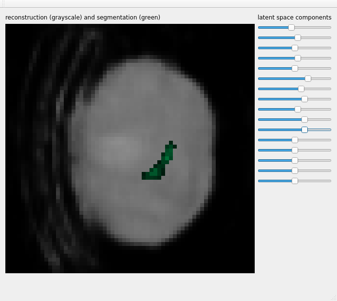

# VAE Latent Space Viewer
A simple viewer for exploring the latent space of Variational Autoencoder models. This is just a small demo that comes along with the [VAE Pancreas Segmentation](https://github.com/paraficial/vae_pancreas_segmentation) repository.

A model is provided, trained on pancreas segmentations from the TCIA Pancreas-CT dataset. A random sample from the validation dataset was chosen to be encoded to a latent spacer vector *z* as the center for exploration.